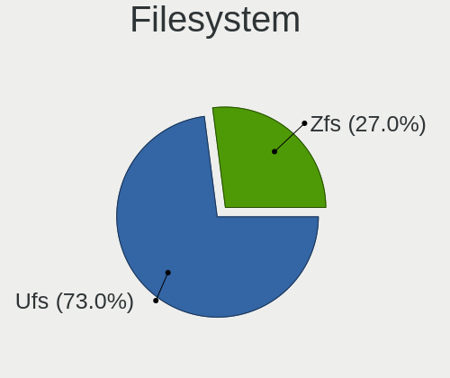
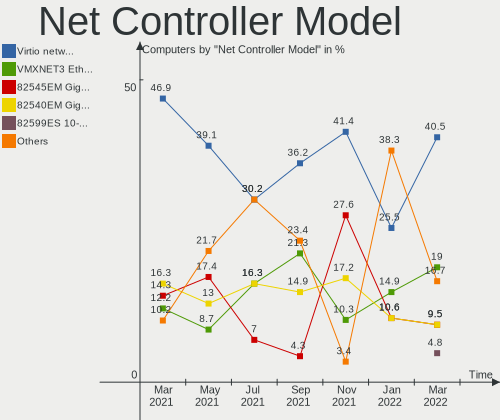
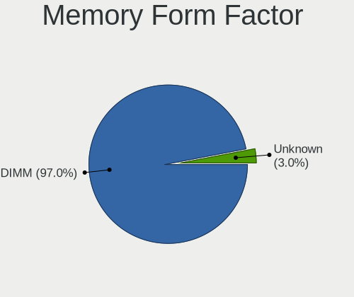

OPNsense Virtual Hardware Trends
--------------------------------

A project to identify most popular virtual hardware characteristics and track their change
over time based on data collected by OPNsense users at https://BSD-Hardware.info.

Anyone can contribute to this report by the [hw-probe](https://github.com/linuxhw/hw-probe/blob/master/INSTALL.BSD.md) tool:

    hw-probe -all -upload

This report is for one last month. Overall report since the beginning of time: [TestCoverage_VE](https://github.com/bsdhw/TestCoverage_VE)

Period: Mar, 2022.

Contents
--------

* [ System ](#system)
  - [ OS                       ](#os)
  - [ OS Family                ](#os-family)
  - [ Arch                     ](#arch)
  - [ DE                       ](#de)
  - [ Display Server           ](#display-server)
  - [ Display Manager          ](#display-manager)
  - [ OS Lang                  ](#os-lang)
  - [ Boot Mode                ](#boot-mode)
  - [ Filesystem               ](#filesystem)
  - [ Part. scheme             ](#part-scheme)

* [ Board ](#board)
  - [ Vendor                   ](#vendor)
  - [ Model                    ](#model)
  - [ Model Family             ](#model-family)
  - [ MFG Year                 ](#mfg-year)
  - [ Form Factor              ](#form-factor)
  - [ Coreboot                 ](#coreboot)
  - [ RAM Size                 ](#ram-size)
  - [ RAM Used                 ](#ram-used)
  - [ Total Drives             ](#total-drives)
  - [ Has CD-ROM               ](#has-cd-rom)
  - [ Has Ethernet             ](#has-ethernet)
  - [ Has WiFi                 ](#has-wifi)
  - [ Has Bluetooth            ](#has-bluetooth)

* [ Location ](#location)
  - [ Country                  ](#country)
  - [ City                     ](#city)

* [ Drives ](#drives)
  - [ Drive Vendor             ](#drive-vendor)
  - [ Drive Model              ](#drive-model)
  - [ HDD Vendor               ](#hdd-vendor)
  - [ SSD Vendor               ](#ssd-vendor)
  - [ Drive Kind               ](#drive-kind)
  - [ Drive Connector          ](#drive-connector)
  - [ Drive Size               ](#drive-size)
  - [ Space Total              ](#space-total)
  - [ Space Used               ](#space-used)
  - [ Malfunc. Drives          ](#malfunc-drives)
  - [ Malfunc. Drive Vendor    ](#malfunc-drive-vendor)
  - [ Malfunc. HDD Vendor      ](#malfunc-hdd-vendor)
  - [ Malfunc. Drive Kind      ](#malfunc-drive-kind)
  - [ Failed Drives            ](#failed-drives)
  - [ Failed Drive Vendor      ](#failed-drive-vendor)
  - [ Drive Status             ](#drive-status)

* [ Storage controller ](#storage-controller)
  - [ Storage Vendor           ](#storage-vendor)
  - [ Storage Model            ](#storage-model)
  - [ Storage Kind             ](#storage-kind)

* [ Processor ](#processor)
  - [ CPU Vendor               ](#cpu-vendor)
  - [ CPU Model                ](#cpu-model)
  - [ CPU Model Family         ](#cpu-model-family)
  - [ CPU Cores                ](#cpu-cores)
  - [ CPU Sockets              ](#cpu-sockets)
  - [ CPU Threads              ](#cpu-threads)
  - [ CPU Microarch            ](#cpu-microarch)

* [ Graphics ](#graphics)
  - [ GPU Vendor               ](#gpu-vendor)
  - [ GPU Model                ](#gpu-model)
  - [ GPU Combo                ](#gpu-combo)
  - [ GPU Driver               ](#gpu-driver)
  - [ GPU Memory               ](#gpu-memory)

* [ Monitor ](#monitor)
  - [ Monitor Vendor           ](#monitor-vendor)
  - [ Monitor Model            ](#monitor-model)
  - [ Monitor Resolution       ](#monitor-resolution)
  - [ Monitor Diagonal         ](#monitor-diagonal)
  - [ Monitor Width            ](#monitor-width)
  - [ Aspect Ratio             ](#aspect-ratio)
  - [ Monitor Area             ](#monitor-area)
  - [ Pixel Density            ](#pixel-density)
  - [ Multiple Monitors        ](#multiple-monitors)

* [ Network ](#network)
  - [ Net Controller Vendor    ](#net-controller-vendor)
  - [ Net Controller Model     ](#net-controller-model)
  - [ Wireless Vendor          ](#wireless-vendor)
  - [ Wireless Model           ](#wireless-model)
  - [ Ethernet Vendor          ](#ethernet-vendor)
  - [ Ethernet Model           ](#ethernet-model)
  - [ Net Controller Kind      ](#net-controller-kind)
  - [ Used Controller          ](#used-controller)
  - [ NICs                     ](#nics)
  - [ IPv6                     ](#ipv6)

* [ Bluetooth ](#bluetooth)
  - [ Bluetooth Vendor         ](#bluetooth-vendor)
  - [ Bluetooth Model          ](#bluetooth-model)

* [ Sound ](#sound)
  - [ Sound Vendor             ](#sound-vendor)
  - [ Sound Model              ](#sound-model)

* [ Memory ](#memory)
  - [ Memory Vendor            ](#memory-vendor)
  - [ Memory Model             ](#memory-model)
  - [ Memory Kind              ](#memory-kind)
  - [ Memory Form Factor       ](#memory-form-factor)
  - [ Memory Size              ](#memory-size)
  - [ Memory Speed             ](#memory-speed)

* [ Printers & scanners ](#printers--scanners)
  - [ Printer Vendor           ](#printer-vendor)
  - [ Printer Model            ](#printer-model)
  - [ Scanner Vendor           ](#scanner-vendor)
  - [ Scanner Model            ](#scanner-model)

* [ Camera ](#camera)
  - [ Camera Vendor            ](#camera-vendor)
  - [ Camera Model             ](#camera-model)

* [ Security ](#security)
  - [ Fingerprint Vendor       ](#fingerprint-vendor)
  - [ Fingerprint Model        ](#fingerprint-model)
  - [ Chipcard Vendor          ](#chipcard-vendor)
  - [ Chipcard Model           ](#chipcard-model)

* [ Unsupported ](#unsupported)
  - [ Unsupported Devices      ](#unsupported-devices)
  - [ Unsupported Device Types ](#unsupported-device-types)

System
------

OS
--

Installed operating systems

| Name            | Computers | Percent |
|-----------------|-----------|---------|
| OPNsense 22.1.2 | 15        | 40.54%  |
| OPNsense 22.1.4 | 10        | 27.03%  |
| OPNsense 22.1.3 | 10        | 27.03%  |
| OPNsense 22.7   | 1         | 2.7%    |
| OPNsense 21.1   | 1         | 2.7%    |

OS Family
---------

OS without a version

| Name     | Computers | Percent |
|----------|-----------|---------|
| OPNsense | 37        | 100%    |

Arch
----

OS architecture (x86_64, i586, etc.)

| Name  | Computers | Percent |
|-------|-----------|---------|
| amd64 | 37        | 100%    |

DE
--

Desktop Environment

| Name    | Computers | Percent |
|---------|-----------|---------|
| Console | 37        | 100%    |

Display Server
--------------

X11 or Wayland

| Name    | Computers | Percent |
|---------|-----------|---------|
| Console | 37        | 100%    |

Display Manager
---------------

SDDM, LightDM, etc.

| Name    | Computers | Percent |
|---------|-----------|---------|
| Console | 37        | 100%    |

OS Lang
-------

Language

| Lang    | Computers | Percent |
|---------|-----------|---------|
| Unknown | 35        | 94.59%  |
| C       | 2         | 5.41%   |

Boot Mode
---------

EFI or BIOS

| Mode | Computers | Percent |
|------|-----------|---------|
| EFI  | 35        | 94.59%  |
| BIOS | 2         | 5.41%   |

Filesystem
----------

Type of filesystem

| Type | Computers | Percent |
|------|-----------|---------|
| Ufs  | 27        | 72.97%  |
| Zfs  | 10        | 27.03%  |

Part. scheme
------------

Scheme of partitioning

| Type | Computers | Percent |
|------|-----------|---------|
| GPT  | 35        | 94.59%  |
| MBR  | 2         | 5.41%   |

Board
-----

Vendor
------

Motherboard manufacturer

| Name      | Computers | Percent |
|-----------|-----------|---------|
| QEMU      | 20        | 54.05%  |
| VMware    | 12        | 32.43%  |
| Oracle    | 4         | 10.81%  |
| Microsoft | 1         | 2.7%    |

Model
-----

Motherboard model

| Name                                   | Computers | Percent |
|----------------------------------------|-----------|---------|
| QEMU Standard PC (i440FX + PIIX, 1996) | 12        | 32.43%  |
| VMware Virtual Platform                | 11        | 29.73%  |
| QEMU Standard PC (Q35 + ICH9, 2009)    | 8         | 21.62%  |
| Oracle VirtualBox                      | 4         | 10.81%  |
| VMware VMware7,1                       | 1         | 2.7%    |
| Microsoft Virtual Machine              | 1         | 2.7%    |

Model Family
------------

Motherboard model prefix

| Name              | Computers | Percent |
|-------------------|-----------|---------|
| QEMU Standard     | 20        | 54.05%  |
| VMware Virtual    | 11        | 29.73%  |
| Oracle VirtualBox | 4         | 10.81%  |
| VMware VMware7    | 1         | 2.7%    |
| Microsoft Virtual | 1         | 2.7%    |

MFG Year
--------

Motherboard manufacture year

| Year    | Computers | Percent |
|---------|-----------|---------|
| 2014    | 14        | 37.84%  |
| 2020    | 6         | 16.22%  |
| 2015    | 5         | 13.51%  |
| 2018    | 4         | 10.81%  |
| 2006    | 4         | 10.81%  |
| 2021    | 1         | 2.7%    |
| 2017    | 1         | 2.7%    |
| 2016    | 1         | 2.7%    |
| Unknown | 1         | 2.7%    |

Form Factor
-----------

Physical design of the computer

| Name            | Computers | Percent |
|-----------------|-----------|---------|
| Virtual machine | 37        | 100%    |

Coreboot
--------

Have coreboot on board

| Used | Computers | Percent |
|------|-----------|---------|
| No   | 37        | 100%    |

RAM Size
--------

Total RAM memory

| Size in GB | Computers | Percent |
|------------|-----------|---------|
| 4.01-8.0   | 12        | 32.43%  |
| 8.01-16.0  | 11        | 29.73%  |
| 2.01-3.0   | 10        | 27.03%  |
| 3.01-4.0   | 2         | 5.41%   |
| 16.01-24.0 | 1         | 2.7%    |
| 1.01-2.0   | 1         | 2.7%    |

RAM Used
--------

Used RAM memory

| Used GB  | Computers | Percent |
|----------|-----------|---------|
| 0.01-0.5 | 35        | 94.59%  |
| 0.51-1.0 | 2         | 5.41%   |

Total Drives
------------

Number of drives on board

| Drives | Computers | Percent |
|--------|-----------|---------|
| 1      | 27        | 72.97%  |
| 0      | 8         | 21.62%  |
| 2      | 2         | 5.41%   |

Has CD-ROM
----------

Has CD-ROM on board

| Presented | Computers | Percent |
|-----------|-----------|---------|
| Yes       | 29        | 78.38%  |
| No        | 8         | 21.62%  |

Has Ethernet
------------

Has Ethernet on board

| Presented | Computers | Percent |
|-----------|-----------|---------|
| Yes       | 19        | 51.35%  |
| No        | 18        | 48.65%  |

Has WiFi
--------

Has WiFi module

| Presented | Computers | Percent |
|-----------|-----------|---------|
| No        | 35        | 94.59%  |
| Yes       | 2         | 5.41%   |

Has Bluetooth
-------------

Has Bluetooth module

| Presented | Computers | Percent |
|-----------|-----------|---------|
| No        | 37        | 100%    |

Location
--------

Country
-------

Geographic location (country)

| Country     | Computers | Percent |
|-------------|-----------|---------|
| USA         | 7         | 18.92%  |
| Germany     | 7         | 18.92%  |
| UK          | 4         | 10.81%  |
| Romania     | 4         | 10.81%  |
| France      | 3         | 8.11%   |
| Canada      | 3         | 8.11%   |
| Austria     | 2         | 5.41%   |
| UAE         | 1         | 2.7%    |
| Switzerland | 1         | 2.7%    |
| Serbia      | 1         | 2.7%    |
| Poland      | 1         | 2.7%    |
| Ghana       | 1         | 2.7%    |
| Czechia     | 1         | 2.7%    |
| China       | 1         | 2.7%    |

City
----

Geographic location (city)

| City              | Computers | Percent |
|-------------------|-----------|---------|
| Navodari          | 2         | 5.41%   |
| Berlin            | 2         | 5.41%   |
| Waukesha          | 1         | 2.7%    |
| Washington        | 1         | 2.7%    |
| Warsaw            | 1         | 2.7%    |
| Warendorf         | 1         | 2.7%    |
| Vienna            | 1         | 2.7%    |
| Trois-Rivières | 1         | 2.7%    |
| Sainte-Julie      | 1         | 2.7%    |
| Prague            | 1         | 2.7%    |
| Passau            | 1         | 2.7%    |
| Paris             | 1         | 2.7%    |
| Munich            | 1         | 2.7%    |
| Milton Keynes     | 1         | 2.7%    |
| Los Angeles       | 1         | 2.7%    |
| Groedig           | 1         | 2.7%    |
| Gennevilliers     | 1         | 2.7%    |
| Findlay           | 1         | 2.7%    |
| Ferndown          | 1         | 2.7%    |
| Dubai             | 1         | 2.7%    |
| Dongguan          | 1         | 2.7%    |
| Coventry          | 1         | 2.7%    |
| Courtenay         | 1         | 2.7%    |
| Constanța     | 1         | 2.7%    |
| Bucharest         | 1         | 2.7%    |
| Bubenreuth        | 1         | 2.7%    |
| Brookline         | 1         | 2.7%    |
| Bracknell         | 1         | 2.7%    |
| Berumbur          | 1         | 2.7%    |
| Belgrade          | 1         | 2.7%    |
| Bay City          | 1         | 2.7%    |
| Baar              | 1         | 2.7%    |
| Apple Valley      | 1         | 2.7%    |
| Aix-les-Bains     | 1         | 2.7%    |
| Accra             | 1         | 2.7%    |

Drives
------

Drive Vendor
------------

Hard drive vendors

| Vendor | Computers | Drives | Percent |
|--------|-----------|--------|---------|
| QEMU   | 14        | 15     | 48.28%  |
| VMware | 10        | 11     | 34.48%  |
| VBOX   | 4         | 4      | 13.79%  |
| Msft   | 1         | 1      | 3.45%   |

Drive Model
-----------

Hard drive models

| Model               | Computers | Percent |
|---------------------|-----------|---------|
| QEMU HARDDISK       | 14        | 48.28%  |
| VMware Virtual disk | 8         | 27.59%  |
| VBOX HARDDISK       | 4         | 13.79%  |
| VMware Virtual S    | 2         | 6.9%    |
| Msft Virtual Disk   | 1         | 3.45%   |

HDD Vendor
----------

Hard disk drive vendors

| Vendor | Computers | Drives | Percent |
|--------|-----------|--------|---------|
| QEMU   | 14        | 15     | 48.28%  |
| VMware | 10        | 11     | 34.48%  |
| VBOX   | 4         | 4      | 13.79%  |
| Msft   | 1         | 1      | 3.45%   |

SSD Vendor
----------

Solid state drive vendors

Zero info for selected period =(

Drive Kind
----------

HDD or SSD

| Kind | Computers | Drives | Percent |
|------|-----------|--------|---------|
| HDD  | 29        | 31     | 100%    |

Drive Connector
---------------

SATA, SAS, NVMe, etc.

| Type | Computers | Drives | Percent |
|------|-----------|--------|---------|
| SATA | 29        | 31     | 100%    |

Drive Size
----------

Size of hard drive

| Size in TB | Computers | Drives | Percent |
|------------|-----------|--------|---------|
| 0.01-0.5   | 29        | 31     | 100%    |

Space Total
-----------

Amount of disk space available on the file system

| Size in GB | Computers | Percent |
|------------|-----------|---------|
| 21-50      | 18        | 48.65%  |
| 1-20       | 13        | 35.14%  |
| 101-250    | 3         | 8.11%   |
| 51-100     | 3         | 8.11%   |

Space Used
----------

Amount of used disk space

| Used GB | Computers | Percent |
|---------|-----------|---------|
| 1-20    | 36        | 97.3%   |
| 21-50   | 1         | 2.7%    |

Malfunc. Drives
---------------

Drive models with a malfunction

Zero info for selected period =(

Malfunc. Drive Vendor
---------------------

Vendors of faulty drives

Zero info for selected period =(

Malfunc. HDD Vendor
-------------------

Vendors of faulty HDD drives

Zero info for selected period =(

Malfunc. Drive Kind
-------------------

Kinds of faulty drives

Zero info for selected period =(

Failed Drives
-------------

Failed drive models

Zero info for selected period =(

Failed Drive Vendor
-------------------

Failed drive vendors

Zero info for selected period =(

Drive Status
------------

Number of failed and malfunc. drives

| Status   | Computers | Drives | Percent |
|----------|-----------|--------|---------|
| Detected | 29        | 31     | 100%    |

Storage controller
------------------

Storage Vendor
--------------

Storage controller vendors

| Vendor                    | Computers | Percent |
|---------------------------|-----------|---------|
| Intel                     | 37        | 53.62%  |
| Red Hat                   | 17        | 24.64%  |
| VMware                    | 6         | 8.7%    |
| Broadcom / LSI            | 5         | 7.25%   |
| LSI Logic / Symbios Logic | 4         | 5.8%    |

Storage Model
-------------

Storage controller models

| Model                                                                 | Computers | Percent |
|-----------------------------------------------------------------------|-----------|---------|
| Intel 82371AB/EB/MB PIIX4 IDE                                         | 17        | 23.61%  |
| Red Hat Virtio SCSI                                                   | 14        | 19.44%  |
| Intel 82371SB PIIX3 IDE [Natoma/Triton II]                            | 12        | 16.67%  |
| Intel 82801IR/IO/IH (ICH9R/DO/DH) 6 port SATA Controller [AHCI mode]  | 10        | 13.89%  |
| Broadcom / LSI SAS1068 PCI-X Fusion-MPT SAS                           | 5         | 6.94%   |
| LSI Logic / Symbios Logic 53c1030 PCI-X Fusion-MPT Dual Ultra320 SCSI | 4         | 5.56%   |
| VMware SATA AHCI controller                                           | 3         | 4.17%   |
| Red Hat Virtio block device                                           | 3         | 4.17%   |
| VMware PVSCSI SCSI Controller                                         | 2         | 2.78%   |
| VMware NVMe SSD Controller                                            | 2         | 2.78%   |

Storage Kind
------------

Kind of storage controller (IDE, SATA, NVMe, SAS, ...)

| Kind | Computers | Percent |
|------|-----------|---------|
| IDE  | 29        | 40.85%  |
| SCSI | 21        | 29.58%  |
| SATA | 13        | 18.31%  |
| SAS  | 6         | 8.45%   |
| NVMe | 2         | 2.82%   |

Processor
---------

CPU Vendor
----------

Processor vendors

| Vendor | Computers | Percent |
|--------|-----------|---------|
| QEMU   | 20        | 54.05%  |
| Intel  | 15        | 40.54%  |
| AMD    | 2         | 5.41%   |

CPU Model
---------

Processor models

| Model                                | Computers | Percent |
|--------------------------------------|-----------|---------|
| QEMU pc-q35-6.1                      | 7         | 18.92%  |
| QEMU pc-i440fx-6.1                   | 7         | 18.92%  |
| QEMU pc-i440fx-5.2                   | 3         | 8.11%   |
| Intel Core i9-9900K CPU @ 3.60GHz    | 2         | 5.41%   |
| QEMU pc-q35-6.2                      | 1         | 2.7%    |
| QEMU pc-i440fx-impish                | 1         | 2.7%    |
| QEMU pc-i440fx-4.1                   | 1         | 2.7%    |
| Intel Xeon Silver 4110 CPU @ 2.10GHz | 1         | 2.7%    |
| Intel Xeon CPU X5660 @ 2.80GHz       | 1         | 2.7%    |
| Intel Xeon CPU X5560 @ 2.80GHz       | 1         | 2.7%    |
| Intel Xeon CPU E5620 @ 2.40GHz       | 1         | 2.7%    |
| Intel Xeon CPU E5-2660 0 @ 2.20GHz   | 1         | 2.7%    |
| Intel Xeon CPU E3-1285 v6 @ 4.10GHz  | 1         | 2.7%    |
| Intel Xeon CPU E3-1231 v3 @ 3.40GHz  | 1         | 2.7%    |
| Intel Xeon CPU D-1541 @ 2.10GHz      | 1         | 2.7%    |
| Intel Core i7-4930K CPU @ 3.40GHz    | 1         | 2.7%    |
| Intel Core i5-9400 CPU @ 2.90GHz     | 1         | 2.7%    |
| Intel Core i5-4300U CPU @ 1.90GHz    | 1         | 2.7%    |
| Intel Core i3-3220 CPU @ 3.30GHz     | 1         | 2.7%    |
| Intel Celeron J4105 CPU @ 1.50GHz    | 1         | 2.7%    |
| AMD Ryzen 9 5950X 16-Core Processor  | 1         | 2.7%    |
| AMD Ryzen 5 3600 6-Core Processor    | 1         | 2.7%    |

CPU Model Family
----------------

Processor model prefix

| Model             | Computers | Percent |
|-------------------|-----------|---------|
| Other             | 20        | 54.05%  |
| Intel Xeon        | 7         | 18.92%  |
| Intel Core i9     | 2         | 5.41%   |
| Intel Core i5     | 2         | 5.41%   |
| Intel Xeon Silver | 1         | 2.7%    |
| Intel Core i7     | 1         | 2.7%    |
| Intel Core i3     | 1         | 2.7%    |
| Intel Celeron     | 1         | 2.7%    |
| AMD Ryzen 9       | 1         | 2.7%    |
| AMD Ryzen 5       | 1         | 2.7%    |

CPU Cores
---------

Number of processor cores

| Number | Computers | Percent |
|--------|-----------|---------|
| 4      | 12        | 32.43%  |
| 2      | 12        | 32.43%  |
| 8      | 6         | 16.22%  |
| 1      | 4         | 10.81%  |
| 6      | 3         | 8.11%   |

CPU Sockets
-----------

Number of sockets

| Number | Computers | Percent |
|--------|-----------|---------|
| 1      | 24        | 64.86%  |
| 2      | 8         | 21.62%  |
| 8      | 2         | 5.41%   |
| 4      | 2         | 5.41%   |
| 6      | 1         | 2.7%    |

CPU Threads
-----------

Threads per core (Hyper-Threading)

| Number | Computers | Percent |
|--------|-----------|---------|
| 1      | 37        | 100%    |

CPU Microarch
-------------

Microarchitecture

| Name          | Computers | Percent |
|---------------|-----------|---------|
| NetBurst      | 8         | 21.62%  |
| Westmere      | 4         | 10.81%  |
| KabyLake      | 4         | 10.81%  |
| SandyBridge   | 3         | 8.11%   |
| Zen 2         | 2         | 5.41%   |
| K8 Hammer     | 2         | 5.41%   |
| IvyBridge     | 2         | 5.41%   |
| Haswell       | 2         | 5.41%   |
| Goldmont plus | 2         | 5.41%   |
| Broadwell     | 2         | 5.41%   |
| Unknown       | 2         | 5.41%   |
| Zen 3         | 1         | 2.7%    |
| Zen           | 1         | 2.7%    |
| Skylake       | 1         | 2.7%    |
| Nehalem       | 1         | 2.7%    |

Graphics
--------

GPU Vendor
----------

Vendors of graphics cards

| Vendor                 | Computers | Percent |
|------------------------|-----------|---------|
| Bochs                  | 16        | 43.24%  |
| VMware                 | 15        | 40.54%  |
| Red Hat                | 3         | 8.11%   |
| Microsoft              | 1         | 2.7%    |
| InnoTek Systemberatung | 1         | 2.7%    |
| Cirrus Logic           | 1         | 2.7%    |

GPU Model
---------

Graphics card models

| Model                                              | Computers | Percent |
|----------------------------------------------------|-----------|---------|
| Bochs VGA                                          | 16        | 43.24%  |
| VMware SVGA II Adapter                             | 15        | 40.54%  |
| Red Hat QXL paravirtual graphic card               | 3         | 8.11%   |
| Microsoft Hyper-V virtual VGA                      | 1         | 2.7%    |
| InnoTek Systemberatung VirtualBox Graphics Adapter | 1         | 2.7%    |
| Cirrus Logic GD 5446                               | 1         | 2.7%    |

GPU Combo
---------

Combinations of graphics cards

| Name                       | Computers | Percent |
|----------------------------|-----------|---------|
| Other                      | 16        | 43.24%  |
| 1 x VMware                 | 15        | 40.54%  |
| 1 x Red Hat                | 3         | 8.11%   |
| 1 x Microsoft              | 1         | 2.7%    |
| 1 x InnoTek Systemberatung | 1         | 2.7%    |
| 1 x Cirrus Logic           | 1         | 2.7%    |

GPU Driver
----------

Free vs proprietary

| Driver | Computers | Percent |
|--------|-----------|---------|
| Free   | 37        | 100%    |

GPU Memory
----------

Total video memory

| Size in GB | Computers | Percent |
|------------|-----------|---------|
| Unknown    | 37        | 100%    |

Monitor
-------

Monitor Vendor
--------------

Monitor vendors

Zero info for selected period =(

Monitor Model
-------------

Monitor models

Zero info for selected period =(

Monitor Resolution
------------------

Monitor screen resolution

Zero info for selected period =(

Monitor Diagonal
----------------

Diagonal size in inches

Zero info for selected period =(

Monitor Width
-------------

Physical width

Zero info for selected period =(

Aspect Ratio
------------

Proportional relationship between the width and the height

Zero info for selected period =(

Monitor Area
------------

Area in inch²

Zero info for selected period =(

Pixel Density
-------------

Pixels per inch

Zero info for selected period =(

Multiple Monitors
-----------------

Total monitors connected

| Total | Computers | Percent |
|-------|-----------|---------|
| 0     | 37        | 100%    |

Network
-------

Net Controller Vendor
---------------------

Controller vendors

| Vendor                | Computers | Percent |
|-----------------------|-----------|---------|
| Red Hat               | 17        | 41.46%  |
| Intel                 | 13        | 31.71%  |
| VMware                | 8         | 19.51%  |
| Realtek Semiconductor | 2         | 4.88%   |
| Qumranet              | 1         | 2.44%   |

Net Controller Model
--------------------

Controller models

| Model                                                    | Computers | Percent |
|----------------------------------------------------------|-----------|---------|
| Red Hat Virtio network device                            | 17        | 40.48%  |
| VMware VMXNET3 Ethernet Controller                       | 8         | 19.05%  |
| Intel 82545EM Gigabit Ethernet Controller (Copper)       | 4         | 9.52%   |
| Intel 82540EM Gigabit Ethernet Controller                | 4         | 9.52%   |
| Intel 82599ES 10-Gigabit SFI/SFP+ Network Connection     | 2         | 4.76%   |
| Realtek RTL8821AE 802.11ac PCIe Wireless Network Adapter | 1         | 2.38%   |
| Realtek RTL8125 2.5GbE Controller                        | 1         | 2.38%   |
| Qumranet Virtio network device                           | 1         | 2.38%   |
| Intel I350 Gigabit Network Connection                    | 1         | 2.38%   |
| Intel Ethernet Controller X710 for 10GbE SFP+            | 1         | 2.38%   |
| Intel Centrino Wireless-N 1000 [Condor Peak]             | 1         | 2.38%   |
| Intel 82574L Gigabit Network Connection                  | 1         | 2.38%   |

Wireless Vendor
---------------

Wireless vendors

| Vendor                | Computers | Percent |
|-----------------------|-----------|---------|
| Realtek Semiconductor | 1         | 50%     |
| Intel                 | 1         | 50%     |

Wireless Model
--------------

Wireless models

| Model                                                    | Computers | Percent |
|----------------------------------------------------------|-----------|---------|
| Realtek RTL8821AE 802.11ac PCIe Wireless Network Adapter | 1         | 50%     |
| Intel Centrino Wireless-N 1000 [Condor Peak]             | 1         | 50%     |

Ethernet Vendor
---------------

Ethernet vendors

| Vendor                | Computers | Percent |
|-----------------------|-----------|---------|
| Intel                 | 12        | 57.14%  |
| VMware                | 8         | 38.1%   |
| Realtek Semiconductor | 1         | 4.76%   |

Ethernet Model
--------------

Ethernet models

| Model                                                | Computers | Percent |
|------------------------------------------------------|-----------|---------|
| VMware VMXNET3 Ethernet Controller                   | 8         | 36.36%  |
| Intel 82545EM Gigabit Ethernet Controller (Copper)   | 4         | 18.18%  |
| Intel 82540EM Gigabit Ethernet Controller            | 4         | 18.18%  |
| Intel 82599ES 10-Gigabit SFI/SFP+ Network Connection | 2         | 9.09%   |
| Realtek RTL8125 2.5GbE Controller                    | 1         | 4.55%   |
| Intel I350 Gigabit Network Connection                | 1         | 4.55%   |
| Intel Ethernet Controller X710 for 10GbE SFP+        | 1         | 4.55%   |
| Intel 82574L Gigabit Network Connection              | 1         | 4.55%   |

Net Controller Kind
-------------------

Ethernet, WiFi or modem

| Kind     | Computers | Percent |
|----------|-----------|---------|
| Ethernet | 19        | 48.72%  |
| Unknown  | 18        | 46.15%  |
| WiFi     | 2         | 5.13%   |

Used Controller
---------------

Currently used network controller

| Kind     | Computers | Percent |
|----------|-----------|---------|
| Ethernet | 19        | 90.48%  |
| Unknown  | 2         | 9.52%   |

NICs
----

Total network controllers on board

| Total | Computers | Percent |
|-------|-----------|---------|
| 2     | 17        | 45.95%  |
| 3     | 6         | 16.22%  |
| 1     | 6         | 16.22%  |
| 4     | 4         | 10.81%  |
| 6     | 3         | 8.11%   |
| 0     | 1         | 2.7%    |

IPv6
----

IPv6 vs IPv4

| Used | Computers | Percent |
|------|-----------|---------|
| No   | 32        | 86.49%  |
| Yes  | 5         | 13.51%  |

Bluetooth
---------

Bluetooth Vendor
----------------

Controller vendors

Zero info for selected period =(

Bluetooth Model
---------------

Controller models

Zero info for selected period =(

Sound
-----

Sound Vendor
------------

Sound card vendors

| Vendor  | Computers | Percent |
|---------|-----------|---------|
| Intel   | 13        | 86.67%  |
| Ensoniq | 2         | 13.33%  |

Sound Model
-----------

Sound card models

| Model                                                                      | Computers | Percent |
|----------------------------------------------------------------------------|-----------|---------|
| Intel 82801I (ICH9 Family) HD Audio Controller                             | 8         | 53.33%  |
| Intel 82801AA AC'97 Audio Controller                                       | 3         | 20%     |
| Intel 82801FB/FBM/FR/FW/FRW (ICH6 Family) High Definition Audio Controller | 2         | 13.33%  |
| Ensoniq ES1371/ES1373 / Creative Labs CT2518                               | 2         | 13.33%  |

Memory
------

Memory Vendor
-------------

Memory module vendors

| Vendor             | Computers | Percent |
|--------------------|-----------|---------|
| QEMU               | 20        | 60.61%  |
| Unknown            | 11        | 33.33%  |
| VMware Virtual RAM | 1         | 3.03%   |
| Microsoft          | 1         | 3.03%   |

Memory Model
------------

Memory module models

| Model                                           | Computers | Percent |
|-------------------------------------------------|-----------|---------|
| Unknown                                         | 11        | 32.35%  |
| QEMU RAM Module 4GB DIMM RAM                    | 5         | 14.71%  |
| QEMU RAM Module 2GB DIMM RAM                    | 5         | 14.71%  |
| QEMU RAM Module 8GB DIMM RAM                    | 3         | 8.82%   |
| VMware Virtual RAM RAM VMW-8192MB 8GB DIMM DRAM | 1         | 2.94%   |
| QEMU RAM Module 8096MB DIMM RAM                 | 1         | 2.94%   |
| QEMU RAM Module 6148MB DIMM RAM                 | 1         | 2.94%   |
| QEMU RAM Module 4064MB DIMM RAM                 | 1         | 2.94%   |
| QEMU RAM Module 3GB DIMM RAM                    | 1         | 2.94%   |
| QEMU RAM Module 16000MB DIMM RAM                | 1         | 2.94%   |
| QEMU RAM Module 1536MB DIMM RAM                 | 1         | 2.94%   |
| QEMU RAM Module 10GB DIMM RAM                   | 1         | 2.94%   |
| Microsoft RAM Module 3968MB                     | 1         | 2.94%   |
| Microsoft RAM Module 128MB                      | 1         | 2.94%   |

Memory Kind
-----------

Memory module kinds

| Kind    | Computers | Percent |
|---------|-----------|---------|
| RAM     | 20        | 60.61%  |
| DRAM    | 12        | 36.36%  |
| Unknown | 1         | 3.03%   |

Memory Form Factor
------------------

Physical design of the memory module

| Name    | Computers | Percent |
|---------|-----------|---------|
| DIMM    | 32        | 96.97%  |
| Unknown | 1         | 3.03%   |

Memory Size
-----------

Memory module size

| Size  | Computers | Percent |
|-------|-----------|---------|
| 8192  | 9         | 26.47%  |
| 4096  | 8         | 23.53%  |
| 2048  | 8         | 23.53%  |
| 16000 | 1         | 2.94%   |
| 10240 | 1         | 2.94%   |
| 8096  | 1         | 2.94%   |
| 6148  | 1         | 2.94%   |
| 4064  | 1         | 2.94%   |
| 3968  | 1         | 2.94%   |
| 3072  | 1         | 2.94%   |
| 1536  | 1         | 2.94%   |
| 128   | 1         | 2.94%   |

Memory Speed
------------

Memory module speed

| Speed   | Computers | Percent |
|---------|-----------|---------|
| Unknown | 33        | 100%    |

Printers & scanners
-------------------

Printer Vendor
--------------

Printer device vendors

Zero info for selected period =(

Printer Model
-------------

Printer device models

Zero info for selected period =(

Scanner Vendor
--------------

Scanner device vendors

Zero info for selected period =(

Scanner Model
-------------

Scanner device models

Zero info for selected period =(

Camera
------

Camera Vendor
-------------

Camera device vendors

Zero info for selected period =(

Camera Model
------------

Camera device models

Zero info for selected period =(

Security
--------

Fingerprint Vendor
------------------

Fingerprint sensor vendors

Zero info for selected period =(

Fingerprint Model
-----------------

Fingerprint sensor models

Zero info for selected period =(

Chipcard Vendor
---------------

Chipcard module vendors

Zero info for selected period =(

Chipcard Model
--------------

Chipcard module models

Zero info for selected period =(

Unsupported
-----------

Unsupported Devices
-------------------

Total unsupported devices on board

| Total | Computers | Percent |
|-------|-----------|---------|
| 0     | 35        | 94.59%  |
| 1     | 2         | 5.41%   |

Unsupported Device Types
------------------------

Types of unsupported devices

| Type         | Computers | Percent |
|--------------|-----------|---------|
| Net/wireless | 2         | 100%    |

