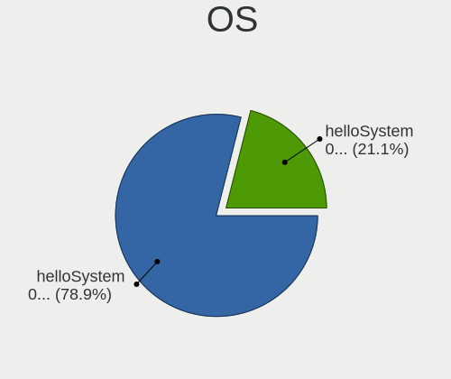
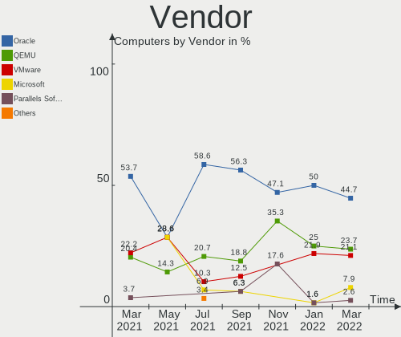
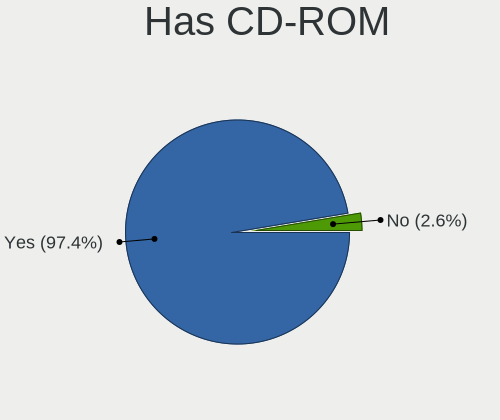
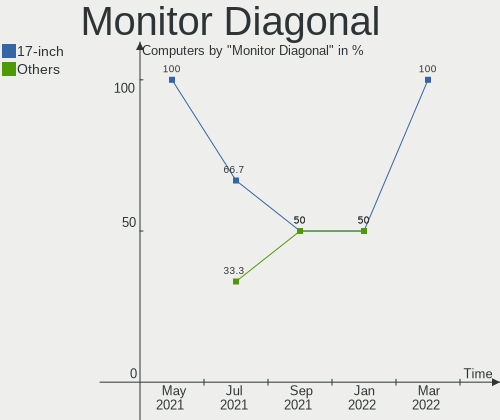

helloSystem Virtual Hardware Trends
-----------------------------------

A project to identify most popular virtual hardware characteristics and track their change
over time based on data collected by helloSystem users at https://BSD-Hardware.info.

Anyone can contribute to this report by the [hw-probe](https://github.com/linuxhw/hw-probe/blob/master/INSTALL.BSD.md) tool:

    hw-probe -all -upload

This report is for one last month. Overall report since the beginning of time: [TestCoverage_VE](https://github.com/bsdhw/TestCoverage_VE)

Period: Mar, 2022.

Contents
--------

* [ System ](#system)
  - [ OS                       ](#os)
  - [ OS Family                ](#os-family)
  - [ Arch                     ](#arch)
  - [ DE                       ](#de)
  - [ Display Server           ](#display-server)
  - [ Display Manager          ](#display-manager)
  - [ OS Lang                  ](#os-lang)
  - [ Boot Mode                ](#boot-mode)
  - [ Filesystem               ](#filesystem)
  - [ Part. scheme             ](#part-scheme)

* [ Board ](#board)
  - [ Vendor                   ](#vendor)
  - [ Model                    ](#model)
  - [ Model Family             ](#model-family)
  - [ MFG Year                 ](#mfg-year)
  - [ Form Factor              ](#form-factor)
  - [ Coreboot                 ](#coreboot)
  - [ RAM Size                 ](#ram-size)
  - [ RAM Used                 ](#ram-used)
  - [ Total Drives             ](#total-drives)
  - [ Has CD-ROM               ](#has-cd-rom)
  - [ Has Ethernet             ](#has-ethernet)
  - [ Has WiFi                 ](#has-wifi)
  - [ Has Bluetooth            ](#has-bluetooth)

* [ Location ](#location)
  - [ Country                  ](#country)
  - [ City                     ](#city)

* [ Drives ](#drives)
  - [ Drive Vendor             ](#drive-vendor)
  - [ Drive Model              ](#drive-model)
  - [ HDD Vendor               ](#hdd-vendor)
  - [ SSD Vendor               ](#ssd-vendor)
  - [ Drive Kind               ](#drive-kind)
  - [ Drive Connector          ](#drive-connector)
  - [ Drive Size               ](#drive-size)
  - [ Space Total              ](#space-total)
  - [ Space Used               ](#space-used)
  - [ Malfunc. Drives          ](#malfunc-drives)
  - [ Malfunc. Drive Vendor    ](#malfunc-drive-vendor)
  - [ Malfunc. HDD Vendor      ](#malfunc-hdd-vendor)
  - [ Malfunc. Drive Kind      ](#malfunc-drive-kind)
  - [ Failed Drives            ](#failed-drives)
  - [ Failed Drive Vendor      ](#failed-drive-vendor)
  - [ Drive Status             ](#drive-status)

* [ Storage controller ](#storage-controller)
  - [ Storage Vendor           ](#storage-vendor)
  - [ Storage Model            ](#storage-model)
  - [ Storage Kind             ](#storage-kind)

* [ Processor ](#processor)
  - [ CPU Vendor               ](#cpu-vendor)
  - [ CPU Model                ](#cpu-model)
  - [ CPU Model Family         ](#cpu-model-family)
  - [ CPU Cores                ](#cpu-cores)
  - [ CPU Sockets              ](#cpu-sockets)
  - [ CPU Threads              ](#cpu-threads)
  - [ CPU Microarch            ](#cpu-microarch)

* [ Graphics ](#graphics)
  - [ GPU Vendor               ](#gpu-vendor)
  - [ GPU Model                ](#gpu-model)
  - [ GPU Combo                ](#gpu-combo)
  - [ GPU Driver               ](#gpu-driver)
  - [ GPU Memory               ](#gpu-memory)

* [ Monitor ](#monitor)
  - [ Monitor Vendor           ](#monitor-vendor)
  - [ Monitor Model            ](#monitor-model)
  - [ Monitor Resolution       ](#monitor-resolution)
  - [ Monitor Diagonal         ](#monitor-diagonal)
  - [ Monitor Width            ](#monitor-width)
  - [ Aspect Ratio             ](#aspect-ratio)
  - [ Monitor Area             ](#monitor-area)
  - [ Pixel Density            ](#pixel-density)
  - [ Multiple Monitors        ](#multiple-monitors)

* [ Network ](#network)
  - [ Net Controller Vendor    ](#net-controller-vendor)
  - [ Net Controller Model     ](#net-controller-model)
  - [ Wireless Vendor          ](#wireless-vendor)
  - [ Wireless Model           ](#wireless-model)
  - [ Ethernet Vendor          ](#ethernet-vendor)
  - [ Ethernet Model           ](#ethernet-model)
  - [ Net Controller Kind      ](#net-controller-kind)
  - [ Used Controller          ](#used-controller)
  - [ NICs                     ](#nics)
  - [ IPv6                     ](#ipv6)

* [ Bluetooth ](#bluetooth)
  - [ Bluetooth Vendor         ](#bluetooth-vendor)
  - [ Bluetooth Model          ](#bluetooth-model)

* [ Sound ](#sound)
  - [ Sound Vendor             ](#sound-vendor)
  - [ Sound Model              ](#sound-model)

* [ Memory ](#memory)
  - [ Memory Vendor            ](#memory-vendor)
  - [ Memory Model             ](#memory-model)
  - [ Memory Kind              ](#memory-kind)
  - [ Memory Form Factor       ](#memory-form-factor)
  - [ Memory Size              ](#memory-size)
  - [ Memory Speed             ](#memory-speed)

* [ Printers & scanners ](#printers--scanners)
  - [ Printer Vendor           ](#printer-vendor)
  - [ Printer Model            ](#printer-model)
  - [ Scanner Vendor           ](#scanner-vendor)
  - [ Scanner Model            ](#scanner-model)

* [ Camera ](#camera)
  - [ Camera Vendor            ](#camera-vendor)
  - [ Camera Model             ](#camera-model)

* [ Security ](#security)
  - [ Fingerprint Vendor       ](#fingerprint-vendor)
  - [ Fingerprint Model        ](#fingerprint-model)
  - [ Chipcard Vendor          ](#chipcard-vendor)
  - [ Chipcard Model           ](#chipcard-model)

* [ Unsupported ](#unsupported)
  - [ Unsupported Devices      ](#unsupported-devices)
  - [ Unsupported Device Types ](#unsupported-device-types)

System
------

OS
--

Installed operating systems

| Name              | Computers | Percent |
|-------------------|-----------|---------|
| helloSystem 0.7.0 | 30        | 78.95%  |
| helloSystem 0.8.0 | 8         | 21.05%  |

OS Family
---------

OS without a version

| Name        | Computers | Percent |
|-------------|-----------|---------|
| helloSystem | 38        | 100%    |

Arch
----

OS architecture (x86_64, i586, etc.)

| Name  | Computers | Percent |
|-------|-----------|---------|
| amd64 | 38        | 100%    |

DE
--

Desktop Environment

| Name         | Computers | Percent |
|--------------|-----------|---------|
| helloDesktop | 38        | 100%    |

Display Server
--------------

X11 or Wayland

| Name | Computers | Percent |
|------|-----------|---------|
| X11  | 38        | 100%    |

Display Manager
---------------

SDDM, LightDM, etc.

| Name | Computers | Percent |
|------|-----------|---------|
| SLiM | 38        | 100%    |

OS Lang
-------

Language

| Lang  | Computers | Percent |
|-------|-----------|---------|
| en_US | 37        | 97.37%  |
| C     | 1         | 2.63%   |

Boot Mode
---------

EFI or BIOS

| Mode | Computers | Percent |
|------|-----------|---------|
| EFI  | 26        | 68.42%  |
| BIOS | 12        | 31.58%  |

Filesystem
----------

Type of filesystem

| Type   | Computers | Percent |
|--------|-----------|---------|
| Zfs    | 23        | 60.53%  |
| Cd9660 | 15        | 39.47%  |

Part. scheme
------------

Scheme of partitioning

| Type | Computers | Percent |
|------|-----------|---------|
| GPT  | 26        | 68.42%  |
| MBR  | 12        | 31.58%  |

Board
-----

Vendor
------

Motherboard manufacturer

| Name                             | Computers | Percent |
|----------------------------------|-----------|---------|
| Oracle                           | 17        | 44.74%  |
| QEMU                             | 9         | 23.68%  |
| VMware                           | 8         | 21.05%  |
| Microsoft                        | 3         | 7.89%   |
| Parallels Software International | 1         | 2.63%   |

Model
-----

Motherboard model

| Name                                                        | Computers | Percent |
|-------------------------------------------------------------|-----------|---------|
| Oracle VirtualBox                                           | 17        | 44.74%  |
| QEMU Standard PC (i440FX + PIIX, 1996)                      | 8         | 21.05%  |
| VMware Virtual Platform                                     | 6         | 15.79%  |
| Microsoft Virtual Machine                                   | 3         | 7.89%   |
| VMware VMware7,1                                            | 2         | 5.26%   |
| QEMU Standard PC (Q35 + ICH9, 2009)                         | 1         | 2.63%   |
| Parallels Software International Parallels Virtual Platform | 1         | 2.63%   |

Model Family
------------

Motherboard model prefix

| Name                                       | Computers | Percent |
|--------------------------------------------|-----------|---------|
| Oracle VirtualBox                          | 17        | 44.74%  |
| QEMU Standard                              | 9         | 23.68%  |
| VMware Virtual                             | 6         | 15.79%  |
| Microsoft Virtual                          | 3         | 7.89%   |
| VMware VMware7                             | 2         | 5.26%   |
| Parallels Software International Parallels | 1         | 2.63%   |

MFG Year
--------

Motherboard manufacture year

| Year | Computers | Percent |
|------|-----------|---------|
| 2006 | 17        | 44.74%  |
| 2020 | 7         | 18.42%  |
| 2014 | 7         | 18.42%  |
| 2018 | 3         | 7.89%   |
| 2021 | 2         | 5.26%   |
| 2015 | 2         | 5.26%   |

Form Factor
-----------

Physical design of the computer

| Name            | Computers | Percent |
|-----------------|-----------|---------|
| Virtual machine | 38        | 100%    |

Coreboot
--------

Have coreboot on board

| Used | Computers | Percent |
|------|-----------|---------|
| No   | 38        | 100%    |

RAM Size
--------

Total RAM memory

| Size in GB | Computers | Percent |
|------------|-----------|---------|
| 2.01-3.0   | 13        | 34.21%  |
| 4.01-8.0   | 11        | 28.95%  |
| 8.01-16.0  | 5         | 13.16%  |
| 1.01-2.0   | 3         | 7.89%   |
| 0.51-1.0   | 3         | 7.89%   |
| 16.01-24.0 | 2         | 5.26%   |
| 3.01-4.0   | 1         | 2.63%   |

RAM Used
--------

Used RAM memory

| Used GB  | Computers | Percent |
|----------|-----------|---------|
| 0.01-0.5 | 35        | 92.11%  |
| 0.51-1.0 | 3         | 7.89%   |

Total Drives
------------

Number of drives on board

| Drives | Computers | Percent |
|--------|-----------|---------|
| 1      | 26        | 68.42%  |
| 0      | 12        | 31.58%  |

Has CD-ROM
----------

Has CD-ROM on board

| Presented | Computers | Percent |
|-----------|-----------|---------|
| Yes       | 37        | 97.37%  |
| No        | 1         | 2.63%   |

Has Ethernet
------------

Has Ethernet on board

| Presented | Computers | Percent |
|-----------|-----------|---------|
| Yes       | 30        | 78.95%  |
| No        | 8         | 21.05%  |

Has WiFi
--------

Has WiFi module

| Presented | Computers | Percent |
|-----------|-----------|---------|
| No        | 38        | 100%    |

Has Bluetooth
-------------

Has Bluetooth module

| Presented | Computers | Percent |
|-----------|-----------|---------|
| No        | 37        | 97.37%  |
| Yes       | 1         | 2.63%   |

Location
--------

Country
-------

Geographic location (country)

| Country   | Computers | Percent |
|-----------|-----------|---------|
| USA       | 5         | 13.16%  |
| Russia    | 3         | 7.89%   |
| Czechia   | 3         | 7.89%   |
| China     | 3         | 7.89%   |
| Taiwan    | 2         | 5.26%   |
| Japan     | 2         | 5.26%   |
| Indonesia | 2         | 5.26%   |
| Hungary   | 2         | 5.26%   |
| France    | 2         | 5.26%   |
| Brazil    | 2         | 5.26%   |
| UK        | 1         | 2.63%   |
| Sweden    | 1         | 2.63%   |
| Spain     | 1         | 2.63%   |
| Lebanon   | 1         | 2.63%   |
| Italy     | 1         | 2.63%   |
| Guatemala | 1         | 2.63%   |
| Greece    | 1         | 2.63%   |
| Germany   | 1         | 2.63%   |
| Canada    | 1         | 2.63%   |
| Belgium   | 1         | 2.63%   |
| Austria   | 1         | 2.63%   |
| Australia | 1         | 2.63%   |

City
----

Geographic location (city)

| City                    | Computers | Percent |
|-------------------------|-----------|---------|
| Yunlin                  | 2         | 5.26%   |
| Saitama                 | 2         | 5.26%   |
| Prague                  | 2         | 5.26%   |
| Zhuhai                  | 1         | 2.63%   |
| Yorba Linda             | 1         | 2.63%   |
| Ufa                     | 1         | 2.63%   |
| Thessaloniki            | 1         | 2.63%   |
| Talavera de la Reina    | 1         | 2.63%   |
| Székesfehérvár | 1         | 2.63%   |
| Stockholm               | 1         | 2.63%   |
| Spittal an der Drau     | 1         | 2.63%   |
| Semarang                | 1         | 2.63%   |
| Sao Paulo               | 1         | 2.63%   |
| San Antonio             | 1         | 2.63%   |
| Qiqihar                 | 1         | 2.63%   |
| Pilsen                  | 1         | 2.63%   |
| Paris                   | 1         | 2.63%   |
| Montreal                | 1         | 2.63%   |
| Milan                   | 1         | 2.63%   |
| Melbourne               | 1         | 2.63%   |
| Kurgan                  | 1         | 2.63%   |
| Krasnodar               | 1         | 2.63%   |
| Kingston upon Thames    | 1         | 2.63%   |
| Jakarta                 | 1         | 2.63%   |
| Hampton                 | 1         | 2.63%   |
| Guatemala City          | 1         | 2.63%   |
| Guangzhou               | 1         | 2.63%   |
| Gresham                 | 1         | 2.63%   |
| Frankfurt am Main       | 1         | 2.63%   |
| Everett                 | 1         | 2.63%   |
| Charleroi               | 1         | 2.63%   |
| Cacoal                  | 1         | 2.63%   |
| Budapest                | 1         | 2.63%   |
| Beirut                  | 1         | 2.63%   |
| Beauvais                | 1         | 2.63%   |

Drives
------

Drive Vendor
------------

Hard drive vendors

| Vendor | Computers | Drives | Percent |
|--------|-----------|--------|---------|
| VBOX   | 16        | 16     | 61.54%  |
| VMware | 7         | 7      | 26.92%  |
| Msft   | 3         | 3      | 11.54%  |

Drive Model
-----------

Hard drive models

| Model             | Computers | Percent |
|-------------------|-----------|---------|
| VBOX HARDDISK     | 16        | 61.54%  |
| VMware Virtual S  | 7         | 26.92%  |
| Msft Virtual Disk | 3         | 11.54%  |

HDD Vendor
----------

Hard disk drive vendors

| Vendor | Computers | Drives | Percent |
|--------|-----------|--------|---------|
| VBOX   | 16        | 16     | 61.54%  |
| VMware | 7         | 7      | 26.92%  |
| Msft   | 3         | 3      | 11.54%  |

SSD Vendor
----------

Solid state drive vendors

Zero info for selected period =(

Drive Kind
----------

HDD or SSD

| Kind | Computers | Drives | Percent |
|------|-----------|--------|---------|
| HDD  | 26        | 26     | 100%    |

Drive Connector
---------------

SATA, SAS, NVMe, etc.

| Type | Computers | Drives | Percent |
|------|-----------|--------|---------|
| SATA | 26        | 26     | 100%    |

Drive Size
----------

Size of hard drive

| Size in TB | Computers | Drives | Percent |
|------------|-----------|--------|---------|
| 0.01-0.5   | 26        | 26     | 100%    |

Space Total
-----------

Amount of disk space available on the file system

| Size in GB | Computers | Percent |
|------------|-----------|---------|
| 1-20       | 29        | 76.32%  |
| 51-100     | 6         | 15.79%  |
| 101-250    | 2         | 5.26%   |
| 21-50      | 1         | 2.63%   |

Space Used
----------

Amount of used disk space

| Used GB | Computers | Percent |
|---------|-----------|---------|
| 1-20    | 38        | 100%    |

Malfunc. Drives
---------------

Drive models with a malfunction

Zero info for selected period =(

Malfunc. Drive Vendor
---------------------

Vendors of faulty drives

Zero info for selected period =(

Malfunc. HDD Vendor
-------------------

Vendors of faulty HDD drives

Zero info for selected period =(

Malfunc. Drive Kind
-------------------

Kinds of faulty drives

Zero info for selected period =(

Failed Drives
-------------

Failed drive models

Zero info for selected period =(

Failed Drive Vendor
-------------------

Failed drive vendors

Zero info for selected period =(

Drive Status
------------

Number of failed and malfunc. drives

| Status   | Computers | Drives | Percent |
|----------|-----------|--------|---------|
| Detected | 26        | 26     | 100%    |

Storage controller
------------------

Storage Vendor
--------------

Storage controller vendors

| Vendor                    | Computers | Percent |
|---------------------------|-----------|---------|
| Intel                     | 38        | 73.08%  |
| LSI Logic / Symbios Logic | 8         | 15.38%  |
| Red Hat                   | 5         | 9.62%   |
| VMware                    | 1         | 1.92%   |

Storage Model
-------------

Storage controller models

| Model                                                                 | Computers | Percent |
|-----------------------------------------------------------------------|-----------|---------|
| Intel 82371AB/EB/MB PIIX4 IDE                                         | 26        | 46.43%  |
| LSI Logic / Symbios Logic 53c1030 PCI-X Fusion-MPT Dual Ultra320 SCSI | 8         | 14.29%  |
| Intel 82371SB PIIX3 IDE [Natoma/Triton II]                            | 8         | 14.29%  |
| Red Hat Virtio block device                                           | 5         | 8.93%   |
| Intel 82801HM/HEM (ICH8M/ICH8M-E) SATA Controller [AHCI mode]         | 4         | 7.14%   |
| Intel 82801IR/IO/IH (ICH9R/DO/DH) 6 port SATA Controller [AHCI mode]  | 2         | 3.57%   |
| VMware NVMe SSD Controller                                            | 1         | 1.79%   |
| Intel 82801HR/HO/HH (ICH8R/DO/DH) 6 port SATA Controller [AHCI mode]  | 1         | 1.79%   |
| Intel 82801BA IDE U100 Controller                                     | 1         | 1.79%   |

Storage Kind
------------

Kind of storage controller (IDE, SATA, NVMe, SAS, ...)

| Kind | Computers | Percent |
|------|-----------|---------|
| IDE  | 35        | 62.5%   |
| SCSI | 13        | 23.21%  |
| SATA | 7         | 12.5%   |
| NVMe | 1         | 1.79%   |

Processor
---------

CPU Vendor
----------

Processor vendors

| Vendor  | Computers | Percent |
|---------|-----------|---------|
| Intel   | 19        | 50%     |
| QEMU    | 9         | 23.68%  |
| AMD     | 7         | 18.42%  |
| Unknown | 3         | 7.89%   |

CPU Model
---------

Processor models

| Model                                          | Computers | Percent |
|------------------------------------------------|-----------|---------|
| QEMU pc-i440fx-6.2                             | 3         | 7.89%   |
|                                                | 3         | 7.89%   |
| QEMU pc-i440fx-6.1                             | 2         | 5.26%   |
| Intel Core i7-4610M CPU @ 3.00GHz              | 2         | 5.26%   |
| QEMU pc-q35-6.0                                | 1         | 2.63%   |
| QEMU pc-i440fx-jammy                           | 1         | 2.63%   |
| QEMU pc-i440fx-impish                          | 1         | 2.63%   |
| QEMU pc-i440fx-focal                           | 1         | 2.63%   |
| Intel Xeon CPU X5650 @ 2.67GHz                 | 1         | 2.63%   |
| Intel Core i7-6920HQ CPU @ 2.90GHz             | 1         | 2.63%   |
| Intel Core i7-4810MQ CPU @ 2.80GHz             | 1         | 2.63%   |
| Intel Core i7-3615QM CPU @ 2.30GHz             | 1         | 2.63%   |
| Intel Core i7-10750H CPU @ 2.60GHz             | 1         | 2.63%   |
| Intel Core i7                                  | 1         | 2.63%   |
| Intel Core i5-7200U CPU @ 2.50GHz              | 1         | 2.63%   |
| Intel Core i5-6500 CPU @ 3.20GHz               | 1         | 2.63%   |
| Intel Core i5-4278U CPU @ 2.60GHz              | 1         | 2.63%   |
| Intel Core i5-3470 CPU @ 3.20GHz               | 1         | 2.63%   |
| Intel Core i5-10400 CPU @ 2.90GHz              | 1         | 2.63%   |
| Intel Core i3-6100U CPU @ 2.30GHz              | 1         | 2.63%   |
| Intel Core i3-2328M CPU @ 2.20GHz              | 1         | 2.63%   |
| Intel 11th Gen Core i7-11800H @ 2.30GHz        | 1         | 2.63%   |
| Intel 11th Gen Core i5-11400H @ 2.70GHz        | 1         | 2.63%   |
| Intel 11th Gen Core i5-1135G7 @ 2.40GHz        | 1         | 2.63%   |
| Intel 11th Gen Core i3-1125G4 @ 2.00GHz        | 1         | 2.63%   |
| AMD Ryzen 9 3900X 12-Core Processor            | 1         | 2.63%   |
| AMD Ryzen 7 2700X Eight-Core Processor         | 1         | 2.63%   |
| AMD Ryzen 5 3500U with Radeon Vega Mobile Gfx  | 1         | 2.63%   |
| AMD Ryzen 5 2600 Six-Core Processor            | 1         | 2.63%   |
| AMD E2-9000 RADEON R2, 4 COMPUTE CORES 2C+2G   | 1         | 2.63%   |
| AMD A9-9400 RADEON R5, 5 COMPUTE CORES 2C+3G   | 1         | 2.63%   |
| AMD A10-9700 RADEON R7, 10 COMPUTE CORES 4C+6G | 1         | 2.63%   |

CPU Model Family
----------------

Processor model prefix

| Model         | Computers | Percent |
|---------------|-----------|---------|
| Other         | 17        | 44.74%  |
| Intel Core i7 | 7         | 18.42%  |
| Intel Core i5 | 5         | 13.16%  |
| Intel Core i3 | 2         | 5.26%   |
| AMD Ryzen 5   | 2         | 5.26%   |
| Intel Xeon    | 1         | 2.63%   |
| AMD Ryzen 9   | 1         | 2.63%   |
| AMD Ryzen 7   | 1         | 2.63%   |
| AMD E2        | 1         | 2.63%   |
| AMD A10       | 1         | 2.63%   |

CPU Cores
---------

Number of processor cores

| Number | Computers | Percent |
|--------|-----------|---------|
| 1      | 15        | 39.47%  |
| 2      | 11        | 28.95%  |
| 4      | 6         | 15.79%  |
| 6      | 2         | 5.26%   |
| 3      | 2         | 5.26%   |
| 12     | 1         | 2.63%   |
| 8      | 1         | 2.63%   |

CPU Sockets
-----------

Number of sockets

| Number | Computers | Percent |
|--------|-----------|---------|
| 1      | 28        | 73.68%  |
| 4      | 5         | 13.16%  |
| 6      | 2         | 5.26%   |
| 2      | 2         | 5.26%   |
| 3      | 1         | 2.63%   |

CPU Threads
-----------

Threads per core (Hyper-Threading)

| Number | Computers | Percent |
|--------|-----------|---------|
| 1      | 36        | 94.74%  |
| 2      | 2         | 5.26%   |

CPU Microarch
-------------

Microarchitecture

| Name        | Computers | Percent |
|-------------|-----------|---------|
| Haswell     | 6         | 15.79%  |
| Skylake     | 5         | 13.16%  |
| Zen 2       | 4         | 10.53%  |
| KabyLake    | 4         | 10.53%  |
| Zen+        | 3         | 7.89%   |
| Excavator   | 3         | 7.89%   |
| Westmere    | 2         | 5.26%   |
| TigerLake   | 2         | 5.26%   |
| Penryn      | 2         | 5.26%   |
| IvyBridge   | 2         | 5.26%   |
| CometLake   | 2         | 5.26%   |
| Unknown     | 2         | 5.26%   |
| SandyBridge | 1         | 2.63%   |

Graphics
--------

GPU Vendor
----------

Vendors of graphics cards

| Vendor                 | Computers | Percent |
|------------------------|-----------|---------|
| VMware                 | 23        | 60.53%  |
| Red Hat                | 9         | 23.68%  |
| Microsoft              | 3         | 7.89%   |
| InnoTek Systemberatung | 2         | 5.26%   |
| Parallels              | 1         | 2.63%   |

GPU Model
---------

Graphics card models

| Model                                              | Computers | Percent |
|----------------------------------------------------|-----------|---------|
| VMware SVGA II Adapter                             | 23        | 60.53%  |
| Red Hat QXL paravirtual graphic card               | 9         | 23.68%  |
| Microsoft Hyper-V virtual VGA                      | 3         | 7.89%   |
| InnoTek Systemberatung VirtualBox Graphics Adapter | 2         | 5.26%   |
| Parallels Accelerated Virtual Video Adapter        | 1         | 2.63%   |

GPU Combo
---------

Combinations of graphics cards

| Name                       | Computers | Percent |
|----------------------------|-----------|---------|
| 1 x VMware                 | 23        | 60.53%  |
| 1 x Red Hat                | 9         | 23.68%  |
| 1 x Microsoft              | 3         | 7.89%   |
| 1 x InnoTek Systemberatung | 2         | 5.26%   |
| 1 x Parallels              | 1         | 2.63%   |

GPU Driver
----------

Free vs proprietary

| Driver  | Computers | Percent |
|---------|-----------|---------|
| Free    | 21        | 55.26%  |
| Unknown | 17        | 44.74%  |

GPU Memory
----------

Total video memory

| Size in GB | Computers | Percent |
|------------|-----------|---------|
| Unknown    | 38        | 100%    |

Monitor
-------

Monitor Vendor
--------------

Monitor vendors

| Vendor | Computers | Percent |
|--------|-----------|---------|
| RYI    | 3         | 100%    |

Monitor Model
-------------

Monitor models

| Model                                            | Computers | Percent |
|--------------------------------------------------|-----------|---------|
| RYI 109-B5 RYI0001 1920x1440 360x270mm 17.7-inch | 3         | 100%    |

Monitor Resolution
------------------

Monitor screen resolution

| Resolution | Computers | Percent |
|------------|-----------|---------|
| 1920x1440  | 3         | 100%    |

Monitor Diagonal
----------------

Diagonal size in inches

| Inches | Computers | Percent |
|--------|-----------|---------|
| 17     | 3         | 100%    |

Monitor Width
-------------

Physical width

| Width in mm | Computers | Percent |
|-------------|-----------|---------|
| 351-400     | 3         | 100%    |

Aspect Ratio
------------

Proportional relationship between the width and the height

| Ratio | Computers | Percent |
|-------|-----------|---------|
| 4/3   | 3         | 100%    |

Monitor Area
------------

Area in inch²

| Area in inch² | Computers | Percent |
|----------------|-----------|---------|
| 151-200        | 3         | 100%    |

Pixel Density
-------------

Pixels per inch

| Density | Computers | Percent |
|---------|-----------|---------|
| 121-160 | 3         | 100%    |

Multiple Monitors
-----------------

Total monitors connected

| Total | Computers | Percent |
|-------|-----------|---------|
| 0     | 33        | 86.84%  |
| 1     | 5         | 13.16%  |

Network
-------

Net Controller Vendor
---------------------

Controller vendors

| Vendor                | Computers | Percent |
|-----------------------|-----------|---------|
| Intel                 | 27        | 77.14%  |
| Red Hat               | 4         | 11.43%  |
| Realtek Semiconductor | 3         | 8.57%   |
| Qumranet              | 1         | 2.86%   |

Net Controller Model
--------------------

Controller models

| Model                                                 | Computers | Percent |
|-------------------------------------------------------|-----------|---------|
| Intel 82540EM Gigabit Ethernet Controller             | 17        | 48.57%  |
| Intel 82545EM Gigabit Ethernet Controller (Copper)    | 10        | 28.57%  |
| Red Hat Virtio network device                         | 4         | 11.43%  |
| Realtek RTL-8100/8101L/8139 PCI Fast Ethernet Adapter | 3         | 8.57%   |
| Qumranet Virtio network device                        | 1         | 2.86%   |

Wireless Vendor
---------------

Wireless vendors

Zero info for selected period =(

Wireless Model
--------------

Wireless models

Zero info for selected period =(

Ethernet Vendor
---------------

Ethernet vendors

| Vendor                | Computers | Percent |
|-----------------------|-----------|---------|
| Intel                 | 27        | 90%     |
| Realtek Semiconductor | 3         | 10%     |

Ethernet Model
--------------

Ethernet models

| Model                                                 | Computers | Percent |
|-------------------------------------------------------|-----------|---------|
| Intel 82540EM Gigabit Ethernet Controller             | 17        | 56.67%  |
| Intel 82545EM Gigabit Ethernet Controller (Copper)    | 10        | 33.33%  |
| Realtek RTL-8100/8101L/8139 PCI Fast Ethernet Adapter | 3         | 10%     |

Net Controller Kind
-------------------

Ethernet, WiFi or modem

| Kind     | Computers | Percent |
|----------|-----------|---------|
| Ethernet | 30        | 85.71%  |
| Unknown  | 5         | 14.29%  |

Used Controller
---------------

Currently used network controller

| Kind     | Computers | Percent |
|----------|-----------|---------|
| Ethernet | 30        | 85.71%  |
| Unknown  | 5         | 14.29%  |

NICs
----

Total network controllers on board

| Total | Computers | Percent |
|-------|-----------|---------|
| 1     | 35        | 92.11%  |
| 0     | 3         | 7.89%   |

IPv6
----

IPv6 vs IPv4

| Used | Computers | Percent |
|------|-----------|---------|
| No   | 38        | 100%    |

Bluetooth
---------

Bluetooth Vendor
----------------

Controller vendors

| Vendor | Computers | Percent |
|--------|-----------|---------|
| VMware | 1         | 100%    |

Bluetooth Model
---------------

Controller models

| Model                            | Computers | Percent |
|----------------------------------|-----------|---------|
| VMware Virtual Bluetooth Adapter | 1         | 100%    |

Sound
-----

Sound Vendor
------------

Sound card vendors

| Vendor  | Computers | Percent |
|---------|-----------|---------|
| Intel   | 27        | 77.14%  |
| Ensoniq | 8         | 22.86%  |

Sound Model
-----------

Sound card models

| Model                                                                      | Computers | Percent |
|----------------------------------------------------------------------------|-----------|---------|
| Intel 82801AA AC'97 Audio Controller                                       | 16        | 45.71%  |
| Intel 82801FB/FBM/FR/FW/FRW (ICH6 Family) High Definition Audio Controller | 8         | 22.86%  |
| Ensoniq ES1371/ES1373 / Creative Labs CT2518                               | 8         | 22.86%  |
| Intel Sunrise Point-LP HD Audio                                            | 1         | 2.86%   |
| Intel 82801I (ICH9 Family) HD Audio Controller                             | 1         | 2.86%   |
| Intel 82801BA/BAM AC'97 Audio Controller                                   | 1         | 2.86%   |

Memory
------

Memory Vendor
-------------

Memory module vendors

| Vendor             | Computers | Percent |
|--------------------|-----------|---------|
| QEMU               | 9         | 40.91%  |
| Unknown            | 7         | 31.82%  |
| Microsoft          | 3         | 13.64%  |
| VMware Virtual RAM | 2         | 9.09%   |
| Unknown            | 1         | 4.55%   |

Memory Model
------------

Memory module models

| Model                                            | Computers | Percent |
|--------------------------------------------------|-----------|---------|
| Unknown                                          | 7         | 22.58%  |
| QEMU RAM Module 2GB DIMM RAM                     | 3         | 9.68%   |
| QEMU RAM Module 16GB DIMM RAM                    | 2         | 6.45%   |
| Microsoft RAM Module 3968MB                      | 2         | 6.45%   |
| VMware Virtual RAM RAM VMW-8192MB 8GB DIMM DRAM  | 1         | 3.23%   |
| VMware Virtual RAM RAM VMW-512MB 512MB DIMM DRAM | 1         | 3.23%   |
| VMware Virtual RAM RAM VMW-4096MB 4GB DIMM DRAM  | 1         | 3.23%   |
| VMware Virtual RAM RAM VMW-32MB 32MB DIMM DRAM   | 1         | 3.23%   |
| VMware Virtual RAM RAM VMW-256MB 256MB DIMM DRAM | 1         | 3.23%   |
| VMware Virtual RAM RAM VMW-2048MB 2GB DIMM DRAM  | 1         | 3.23%   |
| VMware Virtual RAM RAM VMW-128MB 128MB DIMM DRAM | 1         | 3.23%   |
| VMware Virtual RAM RAM VMW-1024MB 1GB DIMM DRAM  | 1         | 3.23%   |
| Unknown RAM Module 64MB DIMM DRAM                | 1         | 3.23%   |
| Unknown RAM Module 128MB DIMM DRAM               | 1         | 3.23%   |
| QEMU RAM Module 8GB DIMM RAM                     | 1         | 3.23%   |
| QEMU RAM Module 6GB DIMM RAM                     | 1         | 3.23%   |
| QEMU RAM Module 4GB DIMM RAM                     | 1         | 3.23%   |
| QEMU RAM Module 4000MB DIMM RAM                  | 1         | 3.23%   |
| Microsoft RAM Module 4228MB                      | 1         | 3.23%   |
| Microsoft RAM Module 2GB                         | 1         | 3.23%   |
| Microsoft RAM Module 128MB                       | 1         | 3.23%   |

Memory Kind
-----------

Memory module kinds

| Kind    | Computers | Percent |
|---------|-----------|---------|
| RAM     | 9         | 42.86%  |
| DRAM    | 9         | 42.86%  |
| Unknown | 3         | 14.29%  |

Memory Form Factor
------------------

Physical design of the memory module

| Name    | Computers | Percent |
|---------|-----------|---------|
| DIMM    | 17        | 80.95%  |
| Unknown | 3         | 14.29%  |
| SODIMM  | 1         | 4.76%   |

Memory Size
-----------

Memory module size

| Size  | Computers | Percent |
|-------|-----------|---------|
| 4096  | 7         | 19.44%  |
| 2048  | 7         | 19.44%  |
| 1024  | 3         | 8.33%   |
| 128   | 3         | 8.33%   |
| 16384 | 2         | 5.56%   |
| 8192  | 2         | 5.56%   |
| 3968  | 2         | 5.56%   |
| 512   | 2         | 5.56%   |
| 256   | 2         | 5.56%   |
| 6144  | 1         | 2.78%   |
| 4228  | 1         | 2.78%   |
| 4000  | 1         | 2.78%   |
| 64    | 1         | 2.78%   |
| 32    | 1         | 2.78%   |
| 16    | 1         | 2.78%   |

Memory Speed
------------

Memory module speed

| Speed   | Computers | Percent |
|---------|-----------|---------|
| Unknown | 20        | 95.24%  |
| 667     | 1         | 4.76%   |

Printers & scanners
-------------------

Printer Vendor
--------------

Printer device vendors

| Vendor    | Computers | Percent |
|-----------|-----------|---------|
| PARALLELS | 1         | 100%    |

Printer Model
-------------

Printer device models

| Model                                                                           | Computers | Percent |
|---------------------------------------------------------------------------------|-----------|---------|
| PARALLELS Virtual Printer (/Users/m/Parallels/HelloSystem 0.8.pvm/parallel.txt) | 1         | 100%    |

Scanner Vendor
--------------

Scanner device vendors

Zero info for selected period =(

Scanner Model
-------------

Scanner device models

Zero info for selected period =(

Camera
------

Camera Vendor
-------------

Camera device vendors

| Vendor    | Computers | Percent |
|-----------|-----------|---------|
| PARALLELS | 1         | 100%    |

Camera Model
------------

Camera device models

| Model                        | Computers | Percent |
|------------------------------|-----------|---------|
| PARALLELS FaceTime HD Camera | 1         | 100%    |

Security
--------

Fingerprint Vendor
------------------

Fingerprint sensor vendors

Zero info for selected period =(

Fingerprint Model
-----------------

Fingerprint sensor models

Zero info for selected period =(

Chipcard Vendor
---------------

Chipcard module vendors

Zero info for selected period =(

Chipcard Model
--------------

Chipcard module models

Zero info for selected period =(

Unsupported
-----------

Unsupported Devices
-------------------

Total unsupported devices on board

| Total | Computers | Percent |
|-------|-----------|---------|
| 0     | 38        | 100%    |

Unsupported Device Types
------------------------

Types of unsupported devices

Zero info for selected period =(

